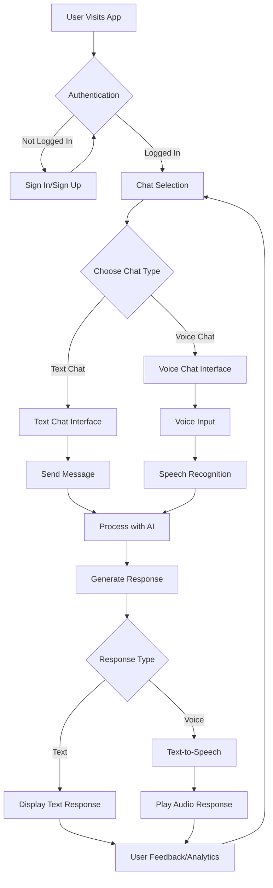

# Iare Campus Bot

## Project info

## How can I edit this code?

There are several ways of editing your application.

## Architecture and Flowchart

### Architecture Overview

This application is a comprehensive campus chatbot with hardware integration, built as a modern web application. The architecture consists of:

- **Frontend**: React application built with TypeScript, using Vite for fast development and building. Styled with Tailwind CSS and shadcn-ui components for a responsive and accessible UI.
- **Backend**: Supabase provides the backend services, including database, authentication, and serverless functions for AI chat processing and text-to-speech.
- **Features**:
  - Text and voice chat interfaces
  - User authentication and profiles
  - Analytics dashboard
  - Hardware device integration for voice input/output
  - Real-time messaging with streaming responses

### Application Flowchart



**Use your preferred IDE**

If you want to work locally using your own IDE, you can clone this repo and push changes. Pushed changes will also be reflected in Iare Campus Bot.

The only requirement is having Node.js & npm installed - [install with nvm](https://github.com/nvm-sh/nvm#installing-and-updating)

Follow these steps:

```sh
# Step 1: Clone the repository using the project's Git URL.
git clone <YOUR_GIT_URL>

# Step 2: Navigate to the project directory.
cd <YOUR_PROJECT_NAME>

# Step 3: Install the necessary dependencies.
npm i

# Step 4: Start the development server with auto-reloading and an instant preview.
npm run dev
```

**Edit a file directly in GitHub**

- Navigate to the desired file(s).
- Click the "Edit" button (pencil icon) at the top right of the file view.
- Make your changes and commit the changes.

**Use GitHub Codespaces**

- Navigate to the main page of your repository.
- Click on the "Code" button (green button) near the top right.
- Select the "Codespaces" tab.
- Click on "New codespace" to launch a new Codespace environment.
- Edit files directly within the Codespace and commit and push your changes once you're done.

## What technologies are used for this project?

This project is built with:

- Vite
- TypeScript
- React
- shadcn-ui
- Tailwind CSS

## How can I deploy this project?

### Deploy to Vercel

1. **Sign up/Login to Vercel**: Go to [vercel.com](https://vercel.com) and sign in with your GitHub account.

2. **Import Project**: Click "New Project" and import your repository from GitHub.

3. **Configure Build Settings**:
   - Framework Preset: Vite
   - Build Command: `npm run build`
   - Output Directory: `dist`
   - Install Command: `npm install`

4. **Environment Variables**: Add any necessary environment variables (e.g., Supabase keys) in the project settings.

5. **Deploy**: Click "Deploy" to start the deployment process.

Your app will be live at a Vercel-provided URL (e.g., `your-project.vercel.app`). You can customize the domain in Vercel's dashboard.
